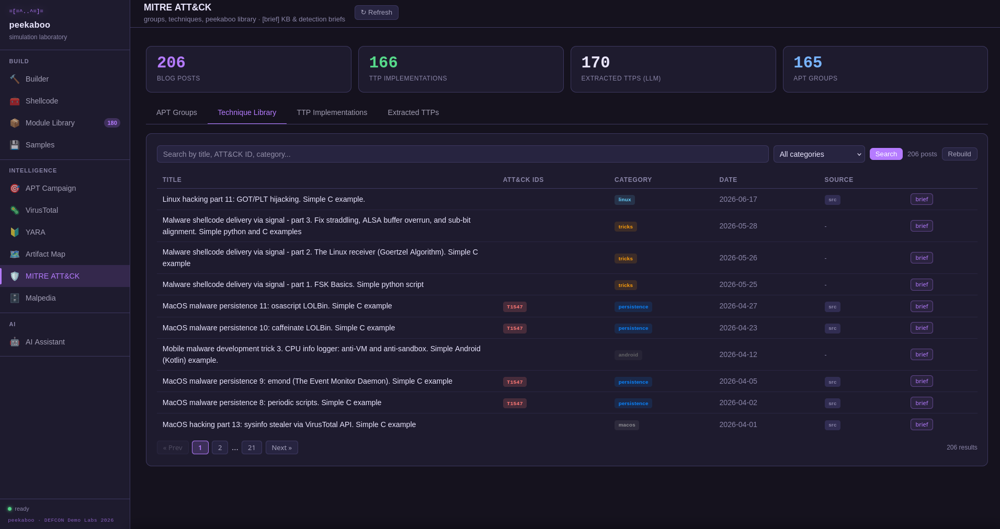
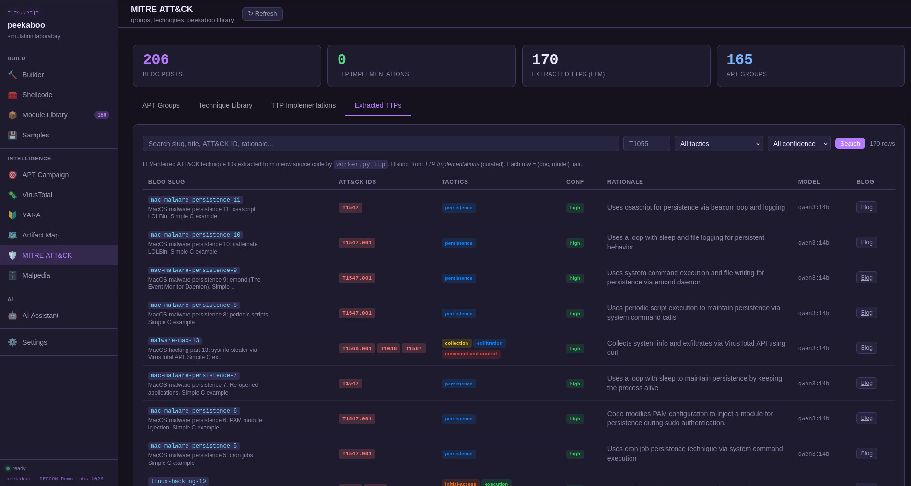
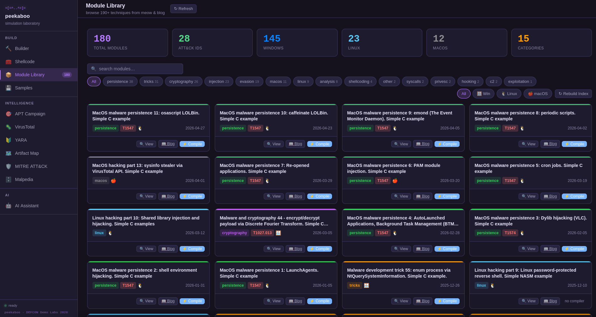
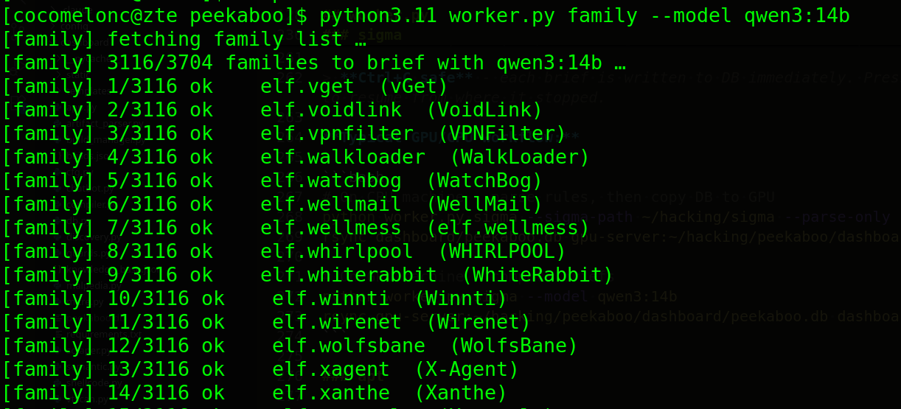
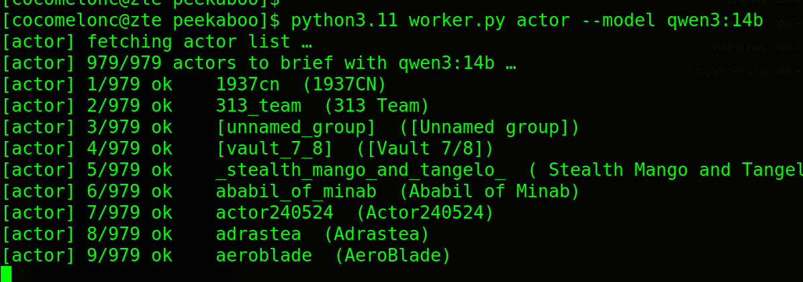
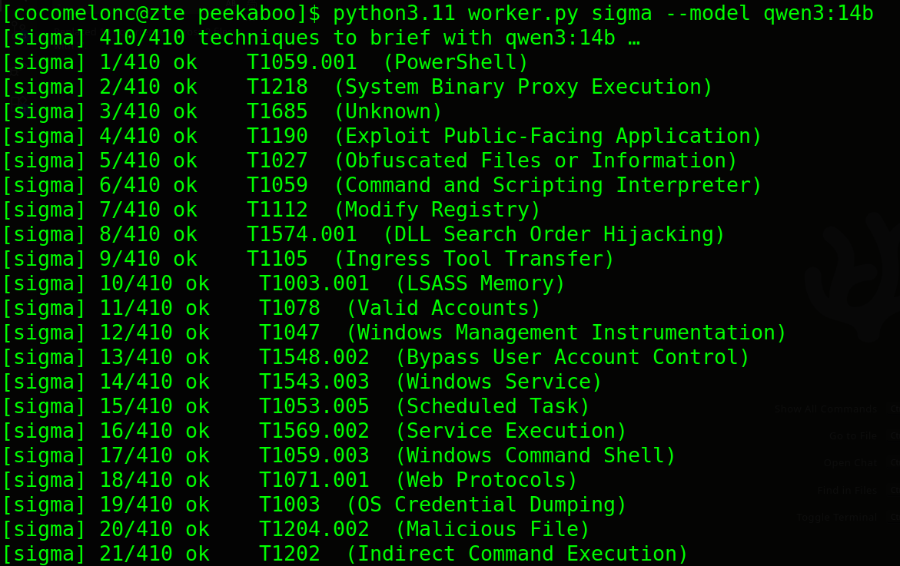

# Peekaboo

    

Peekaboo is a modular framework designed to safely emulate malware behavior. It allows security researchers, red teamers, and blue teamers to reproduce complex threat scenarios - including Command & Control (C2) communication, persistence mechanisms, and lateral movement - without using destructive payloads.

**The goal of Peekaboo is to accelerate detection engineering and operator training by providing predictable, reproducible, and safe threat artifacts.**

<picture>
  <source media="(prefers-color-scheme: dark)" srcset="https://api.star-history.com/chart?repos=cocomelonc/peekaboo&type=date&theme=dark&legend=top-left" />
  <source media="(prefers-color-scheme: light)" srcset="https://api.star-history.com/chart?repos=cocomelonc/peekaboo&type=date&legend=top-left" />
  
</picture>

## key features

- malware **source code template** - build a payload/stealer from templates (select C2 channel & data collection modules).
- **payload generator** - automated generation of C/C++ based payloads with built-in obfuscation (API hashing, string encryption).
- **AV/EDR bypass** - encryption/encoding (syscalls)
- **multi-channel C2** - support for various covert channels:
    - standard HTTP/S
    - GitHub (abusing Issues/Commits)
    - Telegram & Discord Webhooks
    - TODO: adding all channels from one of [my recent research](https://www.youtube.com/watch?v=l2G2TZvzj0E)
- **exfiltration** - staged exfil to controlled endpoints (Github/Discord/Slack/VirusTotal/Azure DevOps/Angelcam).
- **evasive persistence** - modular implementation of Windows persistence (Registry Run Keys, Winlogon, Screensaver).
- **lightweight dashboard** - a python-based C2 backend and dashboard for real-time monitoring of active "beacons".
- **MITRE ATT&CK R&D** - browse 200+ blog post techniques mapped to ATT&CK IDs with inline source code, LLM-extracted TTPs, and per-post GPU-precomputed briefs.
- **Malpedia integration** - threat actor and malware family lookup with semantic blog post matching via local LLM embeddings.
- **AI assistant** - local RAG chatbot (Ollama/qwen3) trained on blog posts and codebase; GPU-precomputed summaries served instantly with typing animation; fully offline.
- **Quick Brief** - type any technique name in the AI assistant panel and get a GPU-precomputed 3-sentence brief instantly - no LLM call at request time.
- **APT campaign pipeline** - end-to-end automated pipeline: Malpedia actor -> threat reports -> TTP extraction -> module selection -> binary compile.
- **YARA rule generator** - auto-generate YARA rules from compiled binaries or uploaded samples.
- **VirusTotal scanner** - submit binaries for AV detection scoring; lookup by SHA256; poll analysis results.
- **Artifact Map** - 400+ ATT&CK techniques cross-referenced with 4,000+ Sigma rules; per-technique EventID coverage, registry keys, processes, command-line indicators; GPU-precomputed detection briefs per technique.
- **single-file config** - all API keys and per-service knobs live in one `.env` file.
- **safe by design** - focuses on telemetry generation rather than actual system damage.

---

## architecture

Peekaboo consists of 5 main components:
First **malware** module - highly portable C/C++ code designed to build specific "behaviors" (for final agent binary) on the target system.
1. **crypto (malware, agent)** - build-in payload encryption/decryption logic constructor for agents.
2. **injection (malware, agent)** - build-in injection logic constructor for agents.
3. **persistence (malware, agent)** - build-in persistence logic constructor for agents (Registry Run Key, Winlogon, Screensaver).
4. **stealer (malware, agent)** - stealer logic (Telegram, GitHub, VirusTotal, Bitbucket, Azure DevOps, Angelcam).

Second, **payloads** module - build-in payloads.
1. **payloads** - for simplicity, just messagebox and reverse shell.

Final, `peekaboo.py` builder in Python.

### demo

Run:

```bash
python3 peekaboo.py
```


---

## dashboard

The dashboard is a Flask-based web UI that combines C2 monitoring, malware building, threat intelligence, and AI assistance in a single interface.

```bash
cd dashboard && python3 app.py
```

    

    

    

    

### modules

| module | description |
|--------|-------------|
| **Builder** | Compile payloads and stealers from source templates with live build log streaming |
| **Shellcode** | Parse, transform, encode, analyse and reformat shellcode in 11 output formats |
| **Module Library** | Browse 190+ malware-research modules sourced from the meow knowledge base |
| **Samples** | Upload and manage compiled samples organized by session |
| **APT Campaign** | Fully automated pipeline: actor -> reports -> TTP extraction -> module selection -> binary compile |
| **VirusTotal** | Submit binaries to VirusTotal for AV detection scoring; lookup by SHA256; poll analysis |
| **YARA** | Auto-generate YARA rules from any binary (From Build, From Session, or Upload) |
| **Artifact Map** | 400+ ATT&CK techniques cross-referenced with 4,000+ Sigma rules; per-technique event IDs, registry, process, and cmdline artifacts; GPU-precomputed detection briefs |
| **MITRE ATT&CK** | Browse 200+ blog posts mapped to ATT&CK techniques; Extracted TTPs tab; per-post GPU briefs; inline source code viewer |
| **Malpedia** | Threat actor and malware family lookup with semantic blog post matching |
| **AI Assistant** | Local RAG chatbot; GPU-precomputed summaries served with typing animation; Quick Brief lookup; fully offline |
| **Settings** | Read-only viewer for `.env`-loaded API keys and service configs |

---

## GPU / CPU split

Heavy LLM work runs once on a GPU machine via `worker.py`. Results are stored in `dashboard/peekaboo.db`. The CPU dashboard only does DB reads - zero LLM calls at request time.

```
GPU machine                         CPU machine (dashboard)
-----------------------------       ----------------------------------
python worker.py embed              cosine similarity search
python worker.py tag         ---->  badge rendering
python worker.py ttp         rsync  extracted TTP table
python worker.py summarize          AI assistant typing animation
python worker.py sigma              artifact map detection briefs
python worker.py apt                campaign brief per session
python worker.py actor              actor threat profile briefs
python worker.py family             malware family behavioral briefs
```

All `worker.py` subcommands are **resumable** - they use `NOT IN` SQL patterns to skip already-processed rows. Interrupt and re-run at any time.

`scan`, `init`, `embed`, `tag`, `ttp`, `summarize`, `sigma`, `apt`, `actor`, and `family` catch `KeyboardInterrupt` and print a clean resume hint instead of a traceback:

```bash
[actor] interrupted at 47/312  (46 saved, 265 remaining)
[actor] resume: python3 worker.py actor --model qwen3:14b
```

    

---

## worker.py

`worker.py` runs from the **project root** (`~/hacking/peekaboo/`) and enriches `dashboard/peekaboo.db` with embeddings, tags, TTPs, and LLM summaries.

```bash
python worker.py <subcommand> [options]
```

    

### subcommands

| subcommand | step | description |
|-----------|------|-------------|
| `scan` | CPU | Walk `_posts/*.markdown` files and import slugs + metadata into `kb_docs` |
| `init` | CPU | Import library cache JSON into `kb_docs` (alternative to `scan`) |
| `embed` | GPU | Compute embedding vectors for all unembedded docs (`nomic-embed-text`) |
| `tag` | GPU/LLM | Classify each doc with constrained-JSON ATT&CK tags |
| `ttp` | GPU/LLM | Extract MITRE ATT&CK IDs, tactics, confidence, and rationale from source code |
| `summarize` | GPU/LLM | Precompute one 3-sentence summary per blog post (what/how/detection) |
| `sigma` | CPU+GPU | Parse Sigma rules into artifact map, then precompute detection briefs per technique |
| `apt` | GPU/LLM | Precompute 3-sentence campaign brief per finished pipeline session |
| `actor` | GPU/LLM | Precompute threat profile brief per Malpedia actor |
| `family` | GPU/LLM | Precompute behavioral brief per Malpedia malware family |
| `refresh` | all | One-shot incremental update: scan → init → embed → tag → (ttp?) → (summarize?) |
| `status` | CPU | Show row counts, pending counts, and stale counts for all tables |

### scan

```bash
python worker.py scan
python worker.py scan --posts ~/hacking/meow/_posts
```

Walks markdown files, extracts frontmatter (title, date, category, ATT&CK IDs), finds associated source files (`.c`, `.cpp`, `.nim`, `.asm`, `.s`), and writes `data/library_cache.json`. Note: results are built in memory and written atomically at the end - if interrupted, no data is saved and re-running restarts the scan from scratch (fast, CPU-only).

> **Ctrl+C safe** - prints a clean message on interrupt. Re-run to redo the scan.

### init

```bash
python worker.py init
```

Imports `data/library_cache.json` into `kb_docs` (idempotent upsert). Each doc is written to DB immediately, so interrupting and re-running will skip already-upserted entries.

> **Ctrl+C safe** - each doc is upserted immediately. Press Ctrl+C at any time; re-run to resume from where it stopped.

### embed

```bash
python worker.py embed
python worker.py embed --model nomic-embed-text --rebuild
```

Computes 768-dim embedding vectors for all docs without an embedding. Stored in `kb_embeddings`. Used by semantic search and Malpedia matching.

| flag | default | description |
|------|---------|-------------|
| `--model` | `nomic-embed-text` | Ollama embedding model |
| `--url` | `http://localhost:11434` | Ollama base URL |
| `--batch` | `32` | Docs per batch |
| `--rebuild` | off | Wipe existing embeddings and recompute |
| `--watch N` | off | Re-run every N seconds |

> **Ctrl+C safe** - each batch is written to DB immediately. Press Ctrl+C at any time; re-run the same command to resume from where it stopped. Also exits `--watch` mode cleanly.

### tag

```bash
python worker.py tag
python worker.py tag --model qwen3:1.7b --rebuild-changed
```

Asks the LLM to classify each doc with ATT&CK tactic tags (constrained JSON output). Tags are used by the chatbot RAG context and the MITRE Library filter.

| flag | default | description |
|------|---------|-------------|
| `--model` | `qwen3:1.7b` | Ollama chat model |
| `--rebuild` | off | Wipe all tags and retag |
| `--rebuild-changed` | off | Only retag docs whose source file changed since last tag |
| `--watch N` | off | Re-run every N seconds |

> **Ctrl+C safe** - each tag is written to DB immediately. Press Ctrl+C at any time; re-run the same command to resume from where it stopped. Also exits `--watch` mode cleanly.

### ttp

```bash
python worker.py ttp
python worker.py ttp --model qwen3:14b
```

Reads each doc's source code file, asks the LLM to extract MITRE ATT&CK IDs with tactic, confidence (`high`/`medium`/`low`), and a one-sentence rationale. Results are stored in `ttp_extracted` and shown in the **Extracted TTPs** tab of the MITRE panel.

| flag | default | description |
|------|---------|-------------|
| `--model` | `qwen3:14b` | Ollama chat model (use a larger model for better accuracy) |
| `--rebuild` | off | Wipe and redo all TTP extraction |
| `--rebuild-changed` | off | Only redo docs whose source changed |

> **Ctrl+C safe** - each result is written to DB immediately. Press Ctrl+C at any time; re-run the same command to resume from where it stopped.

### summarize

```bash
python worker.py summarize
python worker.py summarize --model qwen3:14b --posts ~/hacking/meow/_posts
```

Reads both the blog post markdown and the associated source code for each doc, then asks the LLM to write a 3-sentence summary: what the technique does, how it works at the API/syscall level, and what defenders should look for. Summaries are stored in `kb_summaries` and served by:

- The **AI assistant** template response path (no live LLM call - just DB read + typing animation)
- The **BRIEF block** in the MITRE Library detail card
- The **Quick Brief** lookup in the AI assistant panel

| flag | default | description |
|------|---------|-------------|
| `--model` | `qwen3:14b` | Ollama chat model |
| `--posts PATH` | `$BLOG_POSTS_ROOT` | Root directory of blog post markdown files |
| `--meow-root PATH` | `$MEOW_ROOT` | Root of the meow source repo (for resolving src paths) |
| `--rebuild` | off | Wipe all summaries and recompute |
| `--rebuild-changed` | off | Only recompute summaries for docs whose source or markdown changed |
| `--watch N` | off | Re-run every N seconds |

> **Ctrl+C safe** - each summary is written to DB immediately. Press Ctrl+C at any time; re-run the same command to resume from where it stopped. Also exits `--watch` mode cleanly.

### sigma

```bash
# Step 1 (CPU) - parse 4,000+ Sigma rules into artifact_map
python worker.py sigma --sigma-path ~/hacking/sigma --parse-only

# Step 2 (GPU) - precompute detection briefs per technique
python worker.py sigma --model qwen3:14b

# Full rebuild (if GPU machine also has the sigma repo)
python worker.py sigma --sigma-path ~/hacking/sigma --rebuild --model qwen3:14b
```

    

**Step 1 (parse):** Walks all `.yml` Sigma rule files, extracts per-technique event IDs, registry keys, process images, and command-line patterns, and stores them in `artifact_map`. This is the same data the dashboard "Build from Sigma Rules" button produces - but now runnable from the CLI without a browser.

**Step 2 (LLM):** For each technique in `artifact_map`, builds a detection-focused prompt (TID, name, tactic, event IDs, processes, registry keys, rule count) and asks the LLM to write a 3-sentence detection brief: what the adversary does, the most reliable telemetry to detect it, and one detection recommendation. Stored in `artifact_summaries`.

Briefs appear in the **Overview tab** of the Artifact Map technique modal with a typing animation.

| flag | default | description |
|------|---------|-------------|
| `--sigma-path PATH` | - | Parse Sigma rules from this directory first |
| `--parse-only` | off | Only parse rules, skip LLM step |
| `--model` | `qwen3:14b` | Ollama chat model |
| `--rebuild` | off | Wipe existing LLM briefs and redo all |

> **Ctrl+C safe** - each brief is written to DB immediately. Press Ctrl+C at any time; re-run the same command to resume from where it stopped.

**Typical GPU/CPU workflow:**

```bash
# On CPU machine - parse rules, then copy DB to GPU
python worker.py sigma --sigma-path ~/hacking/sigma --parse-only
rsync dashboard/peekaboo.db gpu-server:~/hacking/peekaboo/dashboard/

# On GPU machine - compute briefs
python worker.py sigma --model qwen3:14b
rsync gpu-server:~/hacking/peekaboo/dashboard/peekaboo.db dashboard/
```

### apt

```bash
python worker.py apt
python worker.py apt --model qwen3:14b --rebuild
```

Reads every finished (`status='success'`) pipeline session from `pipeline_sessions`, builds a prompt from the session's actor ID, ATT&CK technique list, tactics, and implant modules, then asks the LLM to write a 3-sentence campaign brief:

- **Sentence 1** - who the actor is and what they targeted
- **Sentence 2** - key ATT&CK techniques and tactics used
- **Sentence 3** - highest-priority detection recommendation

Briefs are stored in `session_summaries` and served by `/api/apt/brief/<session_id>`. In the **APT Campaign** panel, every row in the sessions table has a `[brief]` button - clicking it opens the slide panel with the precomputed text and a typing animation. No LLM at render time.

| flag | default | description |
|------|---------|-------------|
| `--model` | `qwen3:14b` | Ollama chat model |
| `--url` | `http://localhost:11434` | Ollama base URL |
| `--timeout` | `120` | Per-call timeout (s) |
| `--rebuild` | off | Wipe existing session briefs and redo all |

> **Ctrl+C safe** - each brief is written to DB immediately. Press Ctrl+C at any time; re-run the same command to resume from where it stopped.

### actor

```bash
python worker.py actor
python worker.py actor --model qwen3:14b --rebuild
```

Loads the local Malpedia actor cache (`data/malpedia_actors_cache.json`), fetches each actor's full profile from the API (name, country, suspected targets, victim sectors, incident type, malware families), and asks the LLM to write a 3-sentence threat actor profile:

- **Sentence 1** - who the actor is, suspected origin, and motivation
- **Sentence 2** - typical targets and known malware families
- **Sentence 3** - a behavioral signature defenders should hunt for

Briefs are stored in `actor_summaries` and served by `/api/malpedia/actor/<id>/brief`. In the **Malpedia** panel, the actor/family detail card shows a `[brief]` button inline in the title - clicking it opens the slide panel.

In the CLI `malpedia` sub-REPL, `brief <actor-id>` now auto-routes to the actor profile (or `brief <slug>` for KB posts, or `brief <family-id>` for malware families).

| flag | default | description |
|------|---------|-------------|
| `--model` | `qwen3:14b` | Ollama chat model |
| `--url` | `http://localhost:11434` | Ollama base URL |
| `--timeout` | `120` | Per-call timeout (s) |
| `--rebuild` | off | Wipe existing actor briefs and redo all |

> **Ctrl+C safe** - each brief is written to DB immediately. Press Ctrl+C at any time; re-run the same command to resume from where it stopped.

> **Prerequisite:** Malpedia actor list must be cached first. Run the **Malpedia** panel in the dashboard (actors tab) or call `list_actors()` from the `malpedia` module once.

### family

```bash
python worker.py family
python worker.py family --model qwen3:14b --rebuild
```

Same flow as `actor` but for malware families. Fetches each family's description, alt-names, and attribution from the Malpedia API, then generates a 3-sentence behavioral brief:

- **Sentence 1** - what the malware does and its primary capabilities
- **Sentence 2** - how it persists, evades, or moves laterally
- **Sentence 3** - most actionable detection or hunting recommendation

Briefs are stored in `family_summaries` and served by `/api/malpedia/family/<id>/brief`.

| flag | default | description |
|------|---------|-------------|
| `--model` | `qwen3:14b` | Ollama chat model |
| `--url` | `http://localhost:11434` | Ollama base URL |
| `--timeout` | `120` | Per-call timeout (s) |
| `--rebuild` | off | Wipe existing family briefs and redo all |

> **Ctrl+C safe** - each brief is written to DB immediately. Press Ctrl+C at any time; re-run the same command to resume from where it stopped.

> **Prerequisite:** Malpedia family list must be cached first. Same as `actor`.

### refresh

```bash
python worker.py refresh
python worker.py refresh --scan --ttp --summarize --meow-root ~/hacking/meow
```

One-shot incremental pipeline: runs scan (optional) → init → embed → tag → ttp (optional) → summarize (optional). Skips already-processed rows in every step.

| flag | default | description |
|------|---------|-------------|
| `--scan` | off | Re-scan local `_posts/` before init |
| `--rebuild` | off | Wipe embeddings + tags first |
| `--ttp` | off | Also run TTP extraction |
| `--summarize` | off | Also run summary precompute |
| `--ttp-model` | `qwen3:14b` | Model for TTP extraction |
| `--sum-model` | `qwen3:14b` | Model for summarization |

### status

```bash
python worker.py status
```

Shows row counts and pending/stale counts for all enrichment tables:

```
kb_docs        : 206
kb_embeddings  : 206  (nomic-embed-text)  pending: 0
kb_tags        : 205  (qwen3:1.7b)        pending: 1, stale: 0
ttp_extracted  : 197  (qwen3:14b)         pending: 9, stale: 0
kb_summaries   : 205  (qwen3:14b)         pending: 1, stale: 0
artifact_summ  : 412  (qwen3:14b)         pending: 0
session_summ   : 8    (qwen3:14b)         pending: 0
actor_summ     : 1420 (qwen3:14b)
family_summ    : 2300 (qwen3:14b)
```

---

## Configuration (`.env`)

All API keys, credentials, and per-service knobs live in a single `.env` file at the project root.

```bash
cp .env.example .env
$EDITOR .env   # fill in real tokens
```


| group | example variables |
|-------|------|
| AI: Ollama | `OLLAMA_BASE_URL`, `OLLAMA_MODEL`, `OLLAMA_NUM_CTX` |
| Threat Intel | `MALPEDIA_API_TOKEN`, `VT_API_KEY` |
| Stealer / C2 | `TELEGRAM_BOT_TOKEN`, `GITHUB_TOKEN`, `BITBUCKET_TOKEN_BASE64`, `SLACK_WEBHOOK_URL`, `AZURE_PAT`, `ANGELCAM_API_KEY` |
| APT Pipeline | `APT_PIPELINE_COMPILE_EACH`, `APT_PIPELINE_OLLAMA_NARRATION`, `APT_PIPELINE_OLLAMA_MODEL` |
| Paths | `MEOW_ROOT`, `BLOG_POSTS_ROOT` |

`.env` is gitignored. `.env.example` is the redacted template.

---

## dashboard panels

### Builder

Select malware type (injection or stealer), injection technique, encryption algorithm, payload, stealer channel, and persistence method. Build output streams live to the UI. On success, the compiled binary and persistence binary (if enabled) are available for immediate download.

### Build History

Every build is persisted to SQLite. The history table shows build ID, status badge, module/stealer name, compiler options, timestamp, and download links.

### Samples / Sessions

Upload binary samples captured during red team exercises. Each session groups files by actor/host, stores upload time, and provides direct download links.

### YARA Rule Generator

Auto-generates YARA rules from a binary using string extraction, section name heuristics, import pattern matching, and entropy thresholds.

- **From Build** - select any compiled build binary
- **From Session** - select a captured sample
- **Upload** - drag-and-drop any PE file

### VirusTotal Scanner

Submit binaries directly to VirusTotal. Features: upload, From Build, From Session, SHA256 lookup, and poll for pending analysis.

### MITRE ATT&CK R&D

The MITRE ATT&CK tab has four sub-tabs:

**Techniques** - ATT&CK technique browser grouped by tactic; click any technique to see matched blog posts.

**Technique Library** - all 200+ blog posts indexed from the [meow](https://github.com/cocomelonc/meow) research repository, mapped to ATT&CK IDs.

- Filter by category (injection, persistence, evasion, cryptography, linux, macos, etc.)
- Each row has a `[brief]` button - click to show the GPU-precomputed 3-sentence summary inline, without opening the full detail card
- Click any row to expand the full detail card with inline source code (C, C++, Nim, assembly), blog post link, and **BRIEF** block (GPU summary with typing animation)

**TTP Implementations** - blog posts indexed by extracted ATT&CK ID with tactic, platform, and blog link. The `ttp_implementations` table is seeded automatically at dashboard startup from the static implementation list in `mitre.py` (no manual step required). Filter by tactic, platform, or keyword; click any ATT&CK ID badge to open a detection brief.

**Extracted TTPs** - LLM-inferred ATT&CK mappings per blog post: technique ID, tactic, confidence level, and rationale. Populated by `worker.py ttp`.


### Malpedia integration

The Malpedia tab connects to the [Malpedia REST API](https://malpedia.caad.fkie.fraunhofer.de/) to browse threat actors and malware families. For each actor or family, related blog posts are matched using **semantic similarity** - the actor/family description is embedded via `nomic-embed-text`, then cosine-ranked against all cached post embeddings.


- Search actors by name, country, or malware family
- Expand any actor/family to see techniques, aliases, and semantically matched blog posts with similarity score
- Each actor/family detail card has a `[brief]` button in the title - shows the GPU-precomputed threat profile or behavioral brief in the slide panel (no LLM at render time; requires `worker.py actor` / `worker.py family`)
- Each related blog post row has a `[brief]` button → KB summary from `worker.py summarize`
- Requires a Malpedia API key in `.env` (`MALPEDIA_API_TOKEN`)

### APT campaign pipeline

Fully automated five-stage pipeline: Malpedia actor → threat reports → TTP extraction → module selection → binary compile.


| # | Stage | What it does |
|---|-------|--------------|
| 1 | **Malpedia Fetch** | Resolves actor/family ID, retrieves metadata |
| 2 | **Report Download** | Downloads up to 10 linked threat intelligence reports |
| 3 | **TTP Extraction** | Extracts ATT&CK IDs via regex; offline, no API calls |
| 4 | **Module Selection** | Maps TTPs to peekaboo modules |
| 5 | **Binary Compile** | Builds a Windows PE ready for EDR testing |


All progress streams live to the UI. Every session is persisted to SQLite with Reports, TTPs, and Binary tabs.

Each session row in the history table has a `[brief]` button - shows a GPU-precomputed 3-sentence campaign brief (actor, techniques used, detection priority) in the slide panel. No LLM at render time; requires `worker.py apt`.

### Artifact Map

Cross-references 400+ ATT&CK techniques with 4,000+ Sigma detection rules. For each technique, the map extracts:

- Windows event IDs (Sysmon + Security)
- Registry key patterns
- Process image names
- Command-line indicators
- Logsource categories

**Building the map:**

Option A - browser: open the Artifact Map panel → click **⚙ Build from Sigma Rules**. Progress streams live.

Option B - CLI (recommended for GPU workflows):
```bash
python worker.py sigma --sigma-path ~/hacking/sigma --parse-only
```

**Detection briefs:** after building the map, run `worker.py sigma` on the GPU to precompute a detection-focused 3-sentence brief per technique. Briefs appear in the **Overview tab** of each technique's modal with a typing animation - no LLM call at render time.

### AI assistant

Local RAG chatbot built on the GPU/CPU split architecture.


**How responses work (fastest to slowest):**

1. **Canned answers** - instant; covers "what is Peekaboo?", "how to set up Ollama?", etc.
2. **KB template response** - DB read only; finds matching blog posts with precomputed GPU summaries, streams full source code + brief + ATT&CK links with typing animation. No live LLM call.
3. **Live LLM** - fallback for questions with no precomputed coverage; streams from Ollama with RAG context injected.

**Quick Brief** - a compact lookup card above the chat window. Type any technique slug (e.g. `malware-tricks-58`) or keyword (e.g. `persistence`) and press Enter. Fetches the GPU-precomputed brief from the DB and displays it with typing animation. Falls back to a keyword search across the library if the exact slug is not found.

**Provider:** local Ollama (`qwen3:1.7b` default for chat, `qwen3:14b` for GPU enrichment). Configure via `OLLAMA_MODEL` in `.env`.

---

## CLI (`peekaboo_cli.py`)

The CLI is a rich interactive terminal application with a top-level REPL and dedicated sub-REPLs for each module.

```bash
python3 peekaboo_cli.py
```


| command | description |
|---------|-------------|
| `library` | Browse and search the MITRE ATT&CK blog post library |
| `artifacts` | View and rebuild the Artifact Map |
| `builder` | Compile payloads and stealers interactively |
| `shellcode` | Shellcode analysis and XOR encoding tools |
| `yara` | YARA rule generator sub-REPL |
| `malpedia` | Threat actor and malware family lookup |
| `ttp` | Browse MITRE ATT&CK techniques |
| `vtscan` | VirusTotal scanner sub-REPL |
| `exit` / `quit` | Exit the CLI |

### `library` sub-REPL

| command | description |
|---------|-------------|
| `list [category]` | List all techniques, optionally filtered by category |
| `search <query>` | Full-text search across technique titles |
| `show <slug>` | Display metadata panel + syntax-highlighted source code |
| `brief <slug>` | Print GPU-precomputed 3-sentence summary (from `worker.py summarize`) |
| `categories` | List all available categories |

### `builder` sub-REPL

| command | description |
|---------|-------------|
| `build <injection> [options]` | Build an injection binary |
| `build stealer <name>` | Build a stealer |
| `list injection` | List all injection techniques |
| `history` | Show build history |

### `shellcode` sub-REPL

| command | description |
|---------|-------------|
| `analyse <path>` | Analyse raw shellcode: size, entropy, hex dump |
| `encode <path> [key]` | XOR-encode shellcode |
| `decode <path> [key]` | XOR-decode shellcode |

### `yara` sub-REPL

| command | description |
|---------|-------------|
| `gen <path>` | Generate YARA rule from a PE binary |
| `gen-build [id]` | Generate rule from a compiled build binary |
| `save <path>` | Save the last generated rule to a `.yar` file |

### `malpedia` sub-REPL

| command | description |
|---------|-------------|
| `actors` | List all threat actors |
| `families` | List all malware families |
| `search <query>` | Search by name, country, or alias |
| `actor <id>` | Show actor detail + matched blog posts |
| `family <id>` | Show family detail + matched blog posts |
| `brief <id>` | GPU-precomputed brief - auto-routes to actor profile, family behavioral brief, or KB post summary depending on what `<id>` matches |
| `yara <family-id>` | Fetch Malpedia YARA rules for a malware family |
| `reports [N]` | Show N most recent Malpedia threat reports |

### `ttp` sub-REPL

| command | description |
|---------|-------------|
| `list [tactic]` | List all techniques, optionally filtered by tactic |
| `search <query>` | Search by technique name |
| `show <T-ID>` | Show full technique detail with mapped blog posts |
| `brief <T-ID>` | Print GPU-precomputed detection brief (from `worker.py sigma`) |
| `tactics` | List all ATT&CK tactics |

### `vtscan` sub-REPL

| command | description |
|---------|-------------|
| `scan <path>` | Upload a binary and start analysis |
| `lookup <sha256>` | Fetch existing VT report by SHA256 |
| `poll <analysis-id>` | Poll a pending analysis |

---

## Attention
This tool is a Proof of Concept and is for Educational Purposes Only!!! Author takes no responsibility of any damage you cause

## License
[MIT](https://choosealicense.com/licenses/mit/)
