# Peekaboo

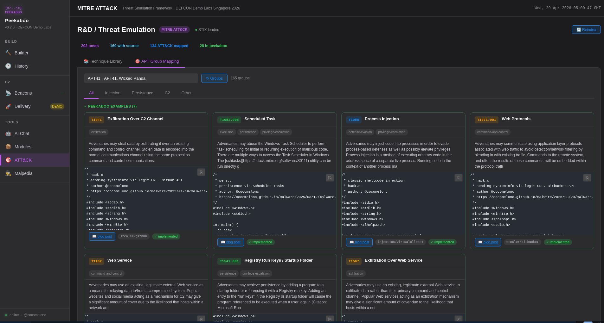          

Peekaboo is a modular framework designed to safely emulate malware behavior. It allows security researchers, red teamers, and blue teamers to reproduce complex threat scenarios - including Command & Control (C2) communication, persistence mechanisms, and lateral movement - without using destructive payloads.     

**The goal of Peekaboo is to accelerate detection engineering and operator training by providing predictable, reproducible, and safe threat artifacts.**    

## key features (how it works?)

- malware **source code template** - build a payload/stealer from templates (select C2 channel & data collection modules).
- **payload generator** - automated generation of C/C++ based payloads with built-in obfuscation (API hashing, string encryption).    
- **AV/EDR bypass** - encryption/encoding (syscalls)        
- **multi-channel C2** - support for various covert channels:
    - standard HTTP/S    
    - GitHub (abusing Issues/Commits)    
    - Telegram & Discord Webhooks    
    - TODO: adding all channels from one of [my recent research](https://www.youtube.com/watch?v=l2G2TZvzj0E)     
- **exfiltration** - staged exfil to controlled endpoints (Github/Discord/Slack/VirusTotal/Azure DevOps/Angelcam).      
- **evasive persistence** - modular implementation of Windows persistence (Registry Run Keys, Winlogon, Screensaver).    
- **lightweight dashboard** - a python-based C2 backend and dashboard for real-time monitoring of active "beacons".
- **MITRE ATT&CK R&D** - browse 200+ blog post techniques mapped to ATT&CK IDs with inline source code (C, C++, Nim, assembly).
- **Malpedia integration** - threat actor and malware family lookup with semantic blog post matching via local LLM embeddings.
- **AI assistant** - local RAG chatbot (Ollama/qwen3) trained on blog posts and codebase; also supports Claude and Gemini.
- **APT campaign pipeline** - end-to-end automated pipeline: Malpedia actor -> threat reports -> TTP extraction (Claude API + regex) -> module selection -> binary compile. Full session history stored in SQLite with per-session report links, TTPs, and download access.
- **YARA rule generator** - auto-generate YARA rules from compiled binaries or uploaded samples; rules can be saved, copied, and downloaded.
- **VirusTotal scanner** - submit binaries for AV detection scoring; lookup by SHA256; poll analysis results; supports From Build and From Session sources.
- **Evasion lab** - static evasion scoring (entropy, imports, strings, PE structure, packer detection) with patch suggestions; supports From Build, From Session, and direct upload.
- **PE inspector** - deep anatomy of PE binaries: DOS / File / Optional / Section headers, imports, exports, Rich header, overlay, packer detection, threat score; supports From Build, From Session, and direct upload.
- **Hell's Gate / Direct Syscall Lab** - parse `ntdll.dll` to extract System Service Numbers for all `Nt*`/`Zw*` exports; detect EDR inline hooks (JMP rel32, FF25, INT3, PUSH/RET trampoline); recover hooked SSNs via Halo's Gate (nearest-clean-neighbour inference) and Tartarus Gate (forward byte scan); generate ready-to-compile NASM x64 or C `__declspec(naked)` direct-syscall stubs.
- **Shellcode Emulator** - x86/x64 CPU emulation via Unicorn Engine with per-instruction disassembly trace (Capstone), memory read/write log, self-modifying code detection, API interception at unmapped call targets, extracted string identification, and standalone disassembly-only mode.
- **Anti-Analysis Pattern Scanner** - static Capstone scan of PE executables or raw shellcode for 15 anti-debug, anti-VM, timing, and sandbox-evasion patterns (RDTSC, CPUID, INT 2D, PEB FS/GS reads, SIDT/SGDT/SLDT, IN EAX/DX VMware backdoor, NOP sleds, PUSHFD Trap Flag probe, VPC magic bytes, and more); findings mapped to MITRE ATT&CK T1622, T1497.001, T1497.003.
- **ROP Chain Builder** - parse PE/DLL/SYS binaries (x64/x86) for Return-Oriented Programming gadgets using Capstone; classify gadgets by semantic role (reg_load, stack_pivot, syscall, arithmetic, mem_write, mem_read, multi_pop, nop_ret, misc); interactive chain builder with per-slot stack argument inputs; generate C `ULONG_PTR` array or Python `struct.pack` payload; supports From Build, From Session, and direct upload.
- **safe by design:** Focuses on telemetry generation (process creation, network connections) rather than actual system damage.      

## architecture

Peekaboo consists of 5 main components:    
First **malware** module - highly portable C/C++ code designed to build specific "behaviors" (for final agent binary) on the target system.            
1. **crypto (malware, agent)** - build-in payload encryption/decryption logic constructor for agents.    
2. **injection (malware, agent)** - build-in injection logic constructor for agents.      
3. **persistence (malware, agent)** - build-in persistence logic constructor for agents (Registry Run Key, Winlogon, Screensaver).     
4. **stealer (malware, agent)** - stealer logic (Telegram, GitHub, VirusTotal, Bitbucket, Azure DevOps, Angelcam).      

Second, **payloads** module - build-in payloads.     
1. **payloads** - for simplicity, just messagebox and reverse shell.      

Final, `peekaboo.py` builder in Python.     

### demo

Run:    

```bash
python3 peekaboo.py
```


## dashboard

The dashboard is a Flask-based web UI that combines C2 monitoring, malware building, threat intelligence, and AI assistance in a single interface.

```bash
cd dashboard && python3 app.py
```

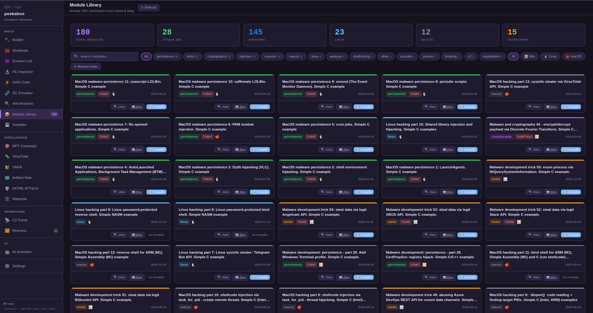    

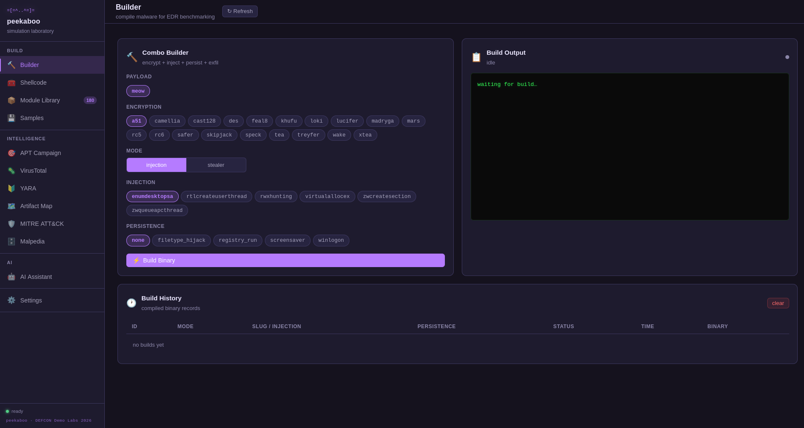    

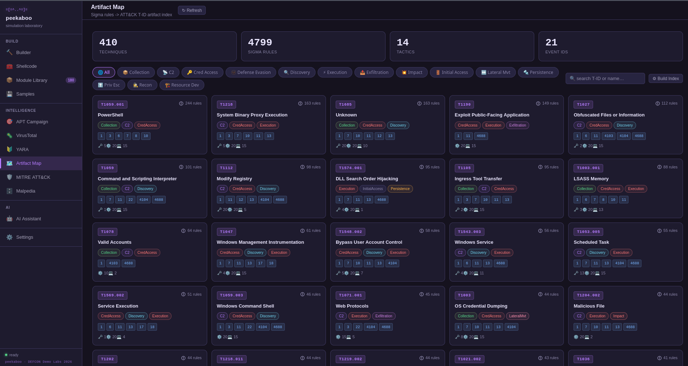    

### modules

| module | description |
|--------|-------------|
| **Builder** | Compile payloads and stealers from source templates with live build log streaming |
| **Build History** | Browse, download, and manage all past builds; per-file download for main binary and persistence binary |
| **Samples** | Upload and manage captured agent samples (pcap, binaries, etc.) organized by session |
| **Beacons** | Real-time monitoring of active agents - hostname, OS, IP, check-in time |
| **C2** | Deliver compiled binaries over Telegram, GitHub Gist, Bitbucket, VT Dead Drop, and Slack; source selector: Upload / From Build / From Session |
| **YARA** | Auto-generate YARA rules from any binary (From Build, From Session, or Upload); save, copy, and download rules |
| **VirusTotal** | Submit binaries to VirusTotal for AV detection scoring; lookup by SHA256; poll analysis; From Build and From Session sources |
| **Evasion Lab** | Static evasion score with category breakdown (entropy, imports, strings, PE structure); patch suggestions; From Build / From Session / Upload |
| **PE Inspector** | Deep PE anatomy: DOS / File / Optional / Section headers, imports, exports, Rich header, overlay, packer detection, threat score; From Session / From Build / Upload |
| **Hell's Gate** | SSN extractor for all `Nt*`/`Zw*` exports; EDR hook detection; Halo's Gate + Tartarus Gate SSN recovery; NASM / C direct-syscall stub generator |
| **SC Emulator** | x86/x64 Unicorn Engine emulation with per-instruction trace, memory log, SMC detection, API interception, string extraction, and disasm-only mode |
| **Anti-Analysis** | Static Capstone scan for 15 anti-debug/anti-VM/timing/evasion patterns; MITRE ATT&CK T1622/T1497 mapping; From Session / From Build / Upload |
| **ROP Builder** | Gadget finder for Windows PE/DLL/SYS x64/x86; semantic classification (reg_load, stack_pivot, syscall, arithmetic, mem_write, mem_read, multi_pop…); chain builder with per-slot arg inputs; C `ULONG_PTR` array / Python `struct.pack` payload generation |
| **APT Campaign** | Fully automated pipeline: actor -> reports -> TTP extraction -> module selection -> binary compile |
| **MITRE ATT&CK** | Browse 200+ blog posts mapped to ATT&CK techniques with inline source code viewer |
| **Malpedia** | Threat actor and malware family lookup with semantic blog post matching |
| **AI Assistant** | RAG chatbot with support for Claude, Gemini, and local Ollama (qwen3); answers questions about the codebase and blog posts |
| **Config** | Inline editor for all API keys and service configs (Telegram, GitHub, Azure, Angelcam, Ollama, Gemini, etc.) |

### Builder

Select malware type (injection or stealer), injection technique, encryption algorithm, payload, stealer channel, and persistence method. Build output streams live to the UI. On success, the compiled binary and persistence binary (if enabled) are available for immediate download.

### Build History

Every build is persisted to SQLite. The history table shows build ID, status badge, module/stealer name, compiler options, timestamp, and download links for each compiled file (main binary + `persistence.exe` when present). Builds can be cleared individually or in bulk.

### Samples / Sessions

Upload binary samples captured during red team exercises. Each session groups files by actor/host, stores upload time, and provides direct download links. Sessions feed the "From Session" source selector in YARA, VirusTotal, Evasion Lab, PE Inspector, and C2 delivery.

### C2 Panel

#### Channel status

Connectivity check for all configured channels (Telegram, GitHub, Bitbucket, VirusTotal, Slack) with live status indicators.

#### Binary source selector

Three source tabs above the delivery buttons:

| tab | description |
|-----|-------------|
| **Upload** | Drag-and-drop or browse a local binary; staged on the server via `POST /api/c2/stage`; staged ID used in all delivery calls |
| **From Build** | Per-file dropdown populated from build history; selects main binary or `persistence.exe` from any successful build |
| **From Session** | Session picker + file picker; delivers any sample uploaded to a session |

If no source is selected the backend falls back to the most recently compiled binary.

#### Delivery channels

| channel | MITRE | description |
|---------|-------|-------------|
| **Telegram** | T1102 + T1105 | Sends binary as `sendDocument` to configured bot/chat |
| **GitHub Gist** | T1102.001 + T1105 | Creates private gist with base64-encoded binary + decode instructions |
| **Bitbucket** | T1102 + T1105 | Commits base64-encoded binary to a Bitbucket repo under `drops/` |
| **VT Dead Drop** | T1102 + T1102.001 | Uploads binary to VirusTotal for analysis, then stages it as base64 chunks in VT file comments; agent retrieves by SHA256, reassembles binary (technique used by Turla, APT28) |
| **Slack** | T1102 + T1071.001 | Posts payload metadata notification to Slack incoming webhook |

After a VT Dead Drop delivery the result panel shows the SHA256, chunk count, and analysis link, plus a **Retrieve Binary** button that simulates the agent-side pull and a **Save Binary** button to download the reassembled file.

### YARA Rule Generator

Auto-generates YARA rules from a binary using string extraction, section name heuristics, import pattern matching, and entropy thresholds. Rules can be generated from:

- **From Build** - select any compiled build binary (or persistence binary)
- **From Session** - select a captured sample
- **Upload** - drag-and-drop any PE file

Generated rules can be copied to clipboard, downloaded as `.yar` files, and saved to the knowledge base.

### VirusTotal Scanner

Submit binaries directly to VirusTotal for AV engine detection scoring. Features:

- **Upload** tab - submit any binary by file upload
- **From Build** tab - select any compiled binary from build history
- **From Session** tab - select a captured sample
- SHA256 **Lookup** - query existing VT reports without re-uploading
- **Poll** - check pending analysis status

Results show detection ratio, engine-by-engine breakdown, and file metadata.

### Evasion Lab

Static evasion scoring engine that estimates how detectable a binary is without executing it. Scores 0–100 across five categories:

| category | what is measured |
|----------|-----------------|
| **Entropy** | Shannon entropy per section; packed/encrypted sections score higher |
| **Imports** | Presence of suspicious API calls (VirtualAllocEx, CreateRemoteThread, etc.) |
| **Strings** | Cleartext IOC strings (IPs, URLs, registry keys, API names) |
| **PE Structure** | Header anomalies, section name mismatches, unusual characteristics |
| **Packer** | Known packer section names (UPX, VMProtect, Themida, etc.) |

Patch suggestions are shown for each category. Patches can be applied to the binary directly from the UI. Sources: From Build / From Session / Upload.

### PE Inspector

Deep static analysis of PE binaries. Input sources: **From Session**, **From Build**, **Upload**.

Result tabs:

| tab | content |
|-----|---------|
| **Overview** | File hashes (MD5 / SHA1 / SHA256), arch, PE type, timestamp, entry point, image base, subsystem, overall entropy, threat score (0–100) |
| **DOS Header** | All 17 MZ fields (`e_magic` through `e_lfanew`) |
| **File Header** | COFF fields: machine type, section count, timestamp, symbol table pointer, characteristics with decoded flag names |
| **Opt Header** | PE32/PE32+ optional header: linker version, code/data sizes, entry point, base addresses, alignment, OS/image/subsystem versions, DLL characteristics with decoded flags |
| **Sections** | Per-section: name, virtual address, virtual size, raw size, raw offset, characteristics, decoded flags, entropy bar, R/W/X indicators, suspicious flag |
| **Imports** | DLL-grouped import table with suspicious API highlighting by category (injection, hollowing, anti-debug, anti-vm, network, execution, persistence, credential, keylog) |
| **Exports** | Exported symbol names, ordinals, and RVAs |
| **Rich Header** | Decoded Rich header entries: tool ID, tool name, build number, use count |
| **Overlay** | Overlay detection: offset, size, entropy, SHA256 of appended data |
| **Packer** | Packer identification by section name signatures (UPX, VMProtect, Themida, MPRESS, ASPack, etc.) |

### Hell's Gate / Direct Syscall Lab

Extracts System Service Numbers (SSNs) directly from a Windows `ntdll.dll` without touching the Win32 API - the core primitive behind Hell's Gate, Halo's Gate, and Tartarus Gate. Upload a copy of `C:\Windows\System32\ntdll.dll` from any Windows target or VM; all parsing runs in Python on the server with no code execution.

**What it does:**

| stage | description |
|-------|-------------|
| **SSN extraction** | Walks the ntdll.dll Export Address Table, collects all `Nt*`/`Zw*` stubs, and reads the `mov eax, <SSN>` immediate from the canonical `4C 8B D1 B8 xx xx xx xx` prologue |
| **EDR hook detection** | Identifies inline hooks at stub entry: JMP rel32 (`E9`), indirect JMP (`FF 25`), INT3 (`CC`), PUSH/RET trampoline (`68 ... C3`), and partial/deep hooks |
| **Halo's Gate recovery** | For every hooked stub, infers the correct SSN by finding the nearest clean neighbour in RVA order (SSNs are contiguous in ntdll's EAT) |
| **Tartarus Gate recovery** | Forward-scans hooked stubs for a `B8 xx xx xx xx` (`mov eax, imm32`) sequence with a value in the plausible SSN range (< 0x600) |
| **Code generation** | Emits ready-to-compile NASM x64 or C `__declspec(naked)` stubs with recovery annotations |

The SSN table is fully filterable (All / Clean / Hooked), searchable by function name, and supports per-row checkbox selection. Shortcut buttons select all hooked stubs or a preset list of 19 common injection APIs (`NtAllocateVirtualMemory`, `NtWriteVirtualMemory`, `NtCreateThreadEx`, `NtProtectVirtualMemory`, etc.).

**References:** Hell's Gate (am0nsec / smelly\_\_vx, VX-Underground) · Halo's Gate (trickster0 / Alice Climent-Monde) · Tartarus Gate (trickster0) · SysWhispers3 (klezVirus)

### SC Emulator

x86/x64 shellcode emulator powered by **Unicorn Engine** with **Capstone** disassembly. Runs shellcode in an isolated virtual CPU with no kernel interaction - safe for analysis of unknown or hostile samples.

**Input modes:**

| mode | description |
|------|-------------|
| **Hex / Paste** | Paste shellcode as `\xNN` escape sequences, `0xNN` comma-separated, or raw hex strings |
| **Upload binary** | Upload a raw `.bin` or `.raw` shellcode file |
| **Disasm only** | Pure Capstone disassembly without execution - instant, no CPU state |

**Emulation features:**

| feature | detail |
|---------|--------|
| **Per-instruction trace** | Address, raw bytes, mnemonic, operands, and live register snapshot for every instruction (up to 500 trace entries shown) |
| **Memory access log** | Every read and write: address, size, value - distinguishes code from data region access |
| **Self-modifying code detection** | Fires when a write lands within the shellcode's own code region; SMC banner shown with the first triggering address |
| **API interception** | Calls to unmapped addresses are caught, recorded with caller address and API hash guess (12 pre-loaded common Win32 hashes), and gracefully redirected - emulation continues past the call |
| **String extraction** | Printable ASCII/UTF-16 strings of 4+ characters assembled from emulated memory writes |
| **Register dump** | Final state of all general-purpose and flags registers on exit |
| **Stop conditions** | Instruction count limit (configurable, max 50 000), wall-clock timeout (10 s), clean `ret` to sentinel address, or CPU exception |

Memory layout: shellcode at `0x00400000`, stack at `0x00200000`, scratch heap at `0x00600000`.

### Anti-Analysis Pattern Scanner

Static disassembly-based scanner that detects anti-debug, anti-VM, timing, and sandbox-evasion techniques in PE binaries or raw shellcode. Uses **Capstone** to disassemble all executable sections and matches 15 pattern rules - no code is executed.

Input sources: **Upload**, **From Session**, **From Build**. Architecture: **Auto** (detected from PE header), **x64**, or **x86**.

**Pattern catalog:**

| ID | Technique | Category | MITRE | Severity |
|----|-----------|----------|-------|----------|
| `RDTSC` | Read timestamp counter | Timing | T1497.003 | High |
| `CPUID` | Hypervisor bit / vendor string probe | Anti-VM | T1497.001 | Medium |
| `INT2D` | INT 2D kernel debug interrupt | Anti-Debug | T1622 | High |
| `INT3_AA` | Inline INT 3 breakpoint trap | Anti-Debug | T1622 | Medium |
| `IN_DX` | VMware I/O backdoor (port 0x5658) | Anti-VM | T1497.001 | High |
| `SIDT` | IDT location probe - Red Pill | Anti-VM | T1497.001 | High |
| `SGDT` | GDT base fingerprint | Anti-VM | T1497.001 | High |
| `SLDT` | LDT selector check | Anti-VM | T1497.001 | Medium |
| `STR_REG` | Task Register selector (VMware = 0x40) | Anti-VM | T1497.001 | Medium |
| `RDPMC` | Performance counter timing side-channel | Timing | T1497.003 | Medium |
| `PEB_READ` | PEB.BeingDebugged via FS:[30h] / GS:[60h] | Anti-Debug | T1622 | High |
| `NOP_SLED` | ≥8 consecutive NOPs (emulator stall) | Evasion | T1497.003 | Low |
| `PUSHFD` | PUSHFD/POPFD Trap Flag probe | Anti-Debug | T1622 | High |
| `VPC_MAGIC` | VPC/Hyper-V magic bytes (0F 3F 07 0B) | Anti-VM | T1497.001 | High |
| `DIV_ZERO` | DIV/IDIV register - SEH trap | Anti-Debug | T1622 | Medium |

Results include: per-category counts, MITRE ATT&CK coverage chips (T1622 / T1497.001 / T1497.003), and a filterable table showing severity badge, technique name, category, MITRE ID, section name, file offset + VA, raw bytes, and description. Findings can be exported as JSON.

### ROP Chain Builder

Static ROP gadget finder for Windows PE executables, DLLs, and SYS drivers (x64 and x86). Uses **Capstone** to disassemble all executable sections and walks backwards from every `ret`/`retn`/`jmp [reg]`/`call [reg]` terminator to collect instruction chains of up to 6 instructions and 24 bytes. No code is executed.

Input sources: **Upload**, **From Session**, **From Build**. Architecture: **Auto** (detected from PE `Machine` field), **x64**, or **x86**. Image base defaults to the PE optional header value and can be overridden for relocatable DLLs.

**Terminator types:**

| type | description |
|------|-------------|
| `ret` | Plain `RET`, `RETN N`, `RETF`, `RETQ` |
| `jmp_reg` | `JMP reg` / `JMP [reg]` / `JMP [reg+offset]` |
| `call_reg` | `CALL reg` / `CALL [reg]` |

**Semantic classification:**

| class | pattern |
|-------|---------|
| `ret_only` | Terminator with no preceding instructions |
| `reg_load` | `pop <reg>; ret` |
| `multi_pop` | Multiple consecutive `pop` instructions |
| `stack_pivot` | `xchg rsp/esp, *` / `mov rsp/esp, reg` / `leave` |
| `syscall` | `syscall; ret` / `sysenter; ret` / `int 0x2e; ret` |
| `reg_mov` | `mov <reg>, <reg>; ret` |
| `mem_write` | `mov [reg…], reg; ret` |
| `mem_read` | `mov reg, [reg…]; ret` |
| `arithmetic` | `add/sub/xor/and/or/neg/shl/shr/ror/rol…; ret` |
| `nop_ret` | All-NOP body + `ret` |
| `misc` | Everything else ending in `ret` |

**UI layout:** two-column view. Left panel: gadget browser with filter pills (by semantic class) + keyword search + scrollable table showing address, RVA, section, bytes, disassembly, and semantic badge. Right panel: sticky chain builder - click **Add** on any gadget row to append it to the chain; each chain slot has an optional stack argument input (64-bit hex). **Generate** produces the selected output format; **Copy** puts it on the clipboard; **Download** saves as `.c` or `.py`.

**Output formats:**

```c
/* C - ULONG_PTR array */
ULONG_PTR rop_chain[] = {
    0x7ffb12340000ULL,  /* pop rax; ret */
    0x0000000000000001ULL,  /* arg: rax = 0x1 */
    ...
};
/* memcpy onto stack or pass to NtCreateThreadEx as start address */
```

```python
# Python - struct.pack
import struct
rop = b""
rop += struct.pack("<Q", 0x7ffb12340000)  # pop rax; ret
rop += struct.pack("<Q", 0x0000000000000001)  # arg: rax = 0x1
```

### MITRE ATT&CK R&D

The MITRE ATT&CK tab indexes all blog posts from the [meow](https://github.com/cocomelonc/meow) research repository and maps them to ATT&CK technique IDs found in the post body. Source code is extracted automatically from the post directory - supporting C, C++, Nim, and assembly (`.asm`/`.s`) files, including posts where source is nested inside subdirectories.


- filter by category (injection, persistence, evasion, cryptography, linux, macos, etc.)
- click any technique to expand the inline source code snippet
- **Full Reindex** button re-runs library scan -> semantic embeddings -> knowledge base in one shot with live progress per step

### Malpedia integration

The Malpedia tab connects to the [Malpedia REST API](https://malpedia.caad.fkie.fraunhofer.de/) to browse threat actors and malware families. For each actor or family, related blog posts are matched using **semantic similarity** - the actor/family description is embedded via `nomic-embed-text` (Ollama), then cosine-ranked against all 200+ cached post embeddings. No hardcoded keyword rules.   

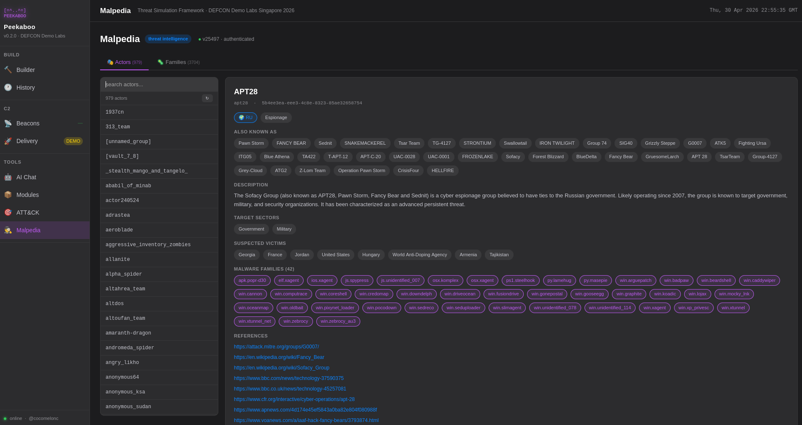

- search actors by name, country, or malware family
- expand any actor/family to see techniques, aliases, and semantically matched blog posts with similarity score
- requires a Malpedia API key in `config/malpedia_config.json`

### APT campaign pipeline

The APT Campaign tab runs a fully automated, five-stage pipeline that takes a Malpedia actor or family identifier and produces a ready-to-test compiled binary in one shot.

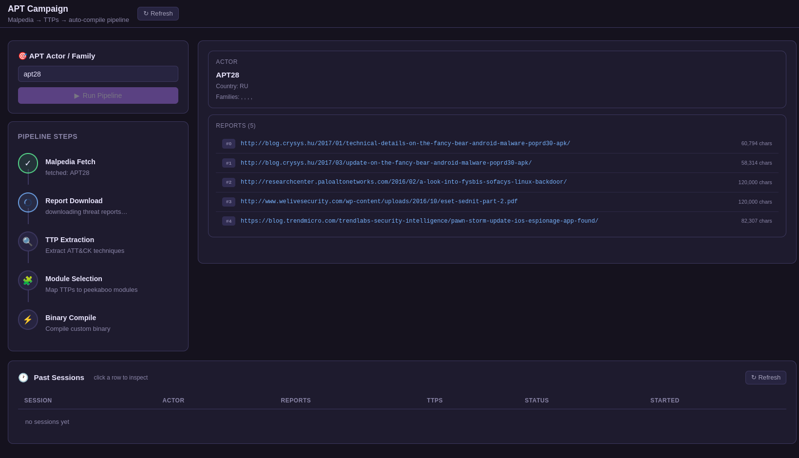

**Pipeline stages:**

| # | Stage | What it does |
|---|-------|--------------|
| 1 | **Malpedia Fetch** | Resolves the actor or family ID against the Malpedia REST API and retrieves associated metadata (country, aliases, malware families, report URLs) |
| 2 | **Report Download** | Downloads up to 10 linked threat intelligence reports and stores raw content in SQLite for later inspection |
| 3 | **TTP Extraction** | Extracts MITRE ATT&CK technique IDs from report text - uses the Claude API for structured extraction with a regex fallback when no API key is configured |
| 4 | **Module Selection** | Maps extracted TTPs to available peekaboo modules (injection, crypto, stealer, persistence) and selects the best match per technique |
| 5 | **Binary Compile** | Runs the peekaboo builder with the selected parameters and produces a Windows PE ready for EDR testing |

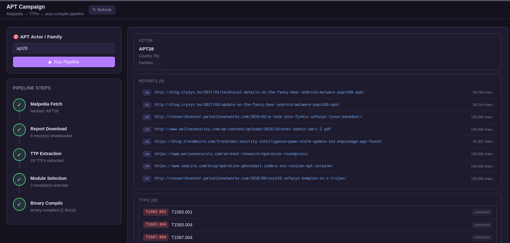

All pipeline progress streams live to the right panel as it runs - reports appear as clickable links the moment they are downloaded, TTPs and selected modules are appended on completion of each stage, and the final binary is immediately available for download. Every session is persisted to SQLite; click any row in **Past Sessions** to open a drawer showing:

- **Reports** tab - list of downloaded reports with a direct link to the original URL and character count
- **TTPs** tab - full list of extracted ATT&CK techniques with tactic and evidence quote
- **Binary** tab - build configuration badges, per-file download links, and selected modules

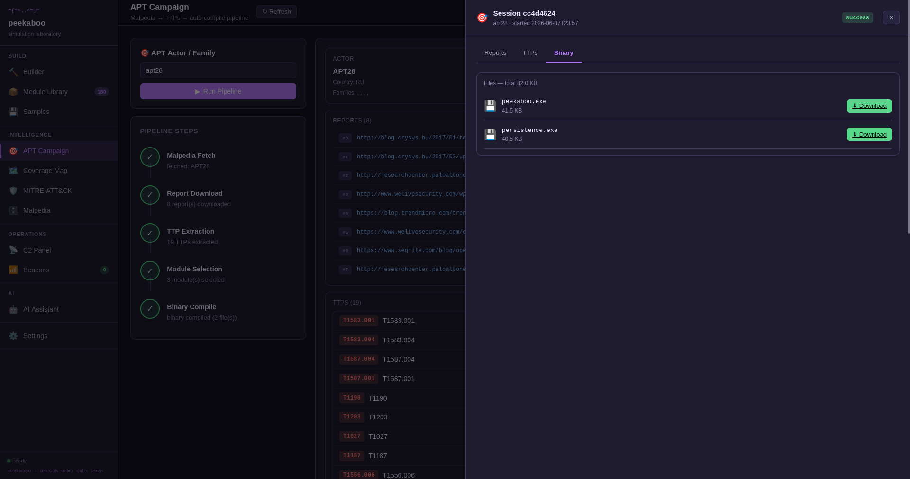

**Configuration:** set `api_key` in `config/anthropic_config.json` to enable Claude-powered TTP extraction. Without it the pipeline falls back to regex matching of `T1xxx` IDs in report text.

### AI assistant

The AI assistant answers questions about malware techniques, the codebase, and blog posts using RAG (Retrieval-Augmented Generation). At query time the question is embedded and matched against all blog post embeddings; the top matching posts are injected as context into the LLM prompt.   

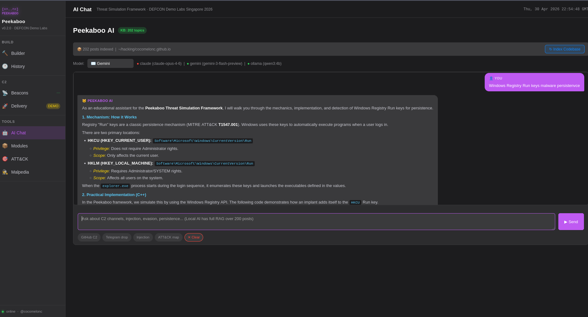

Supported providers:
- **Local (Ollama)** - `qwen3:4b` (or any Ollama model); runs fully offline; thinking mode tokens are filtered before streaming to the UI
- **Claude** (Anthropic API key required)
- **Gemini** (Google API key required)    

## CLI (`peekaboo_cli.py`)

The CLI is a rich interactive terminal application (`peekaboo_cli.py`) with a top-level REPL and dedicated sub-REPLs for each module. Uses `prompt_toolkit` for autocompletion and history, and `rich` for tables, panels, and syntax-highlighted output.

```bash
python3 peekaboo_cli.py
```

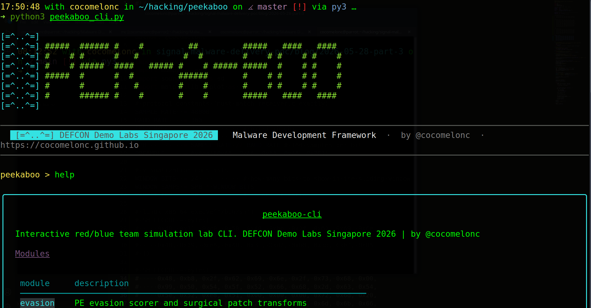    

Top-level commands:    

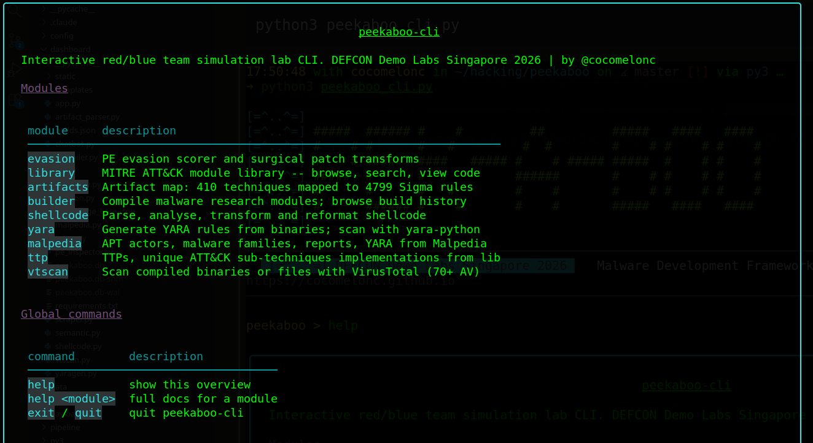        

| command | description |
|---------|-------------|
| `library` | Browse and search the MITRE ATT&CK blog post library |
| `artifacts` | View and rebuild the Artifact Map (embedding index) |
| `builder` | Compile payloads and stealers interactively |
| `shellcode` | Shellcode analysis and XOR encoding tools |
| `yara` | YARA rule generator sub-REPL |
| `malpedia` | Threat actor and malware family lookup |
| `ttp` | Browse MITRE ATT&CK techniques |
| `pe` | PE binary anatomy sub-REPL |
| `vtscan` | VirusTotal scanner sub-REPL |
| `evasion` | Evasion score and patch lab sub-REPL |
| `hellsgate` | Hell's Gate / Halo's Gate / Tartarus Gate SSN extractor and stub generator sub-REPL |
| `scemu` | Shellcode emulator (Unicorn Engine) sub-REPL |
| `antianalysis` | Anti-analysis pattern scanner sub-REPL |
| `rop` | ROP gadget finder and chain builder sub-REPL |
| `help` | Top-level help; `help <module>` for module-specific docs |
| `exit` / `quit` | Exit the CLI |

### `library` sub-REPL

Browse and search 200+ blog post techniques with inline source code display.

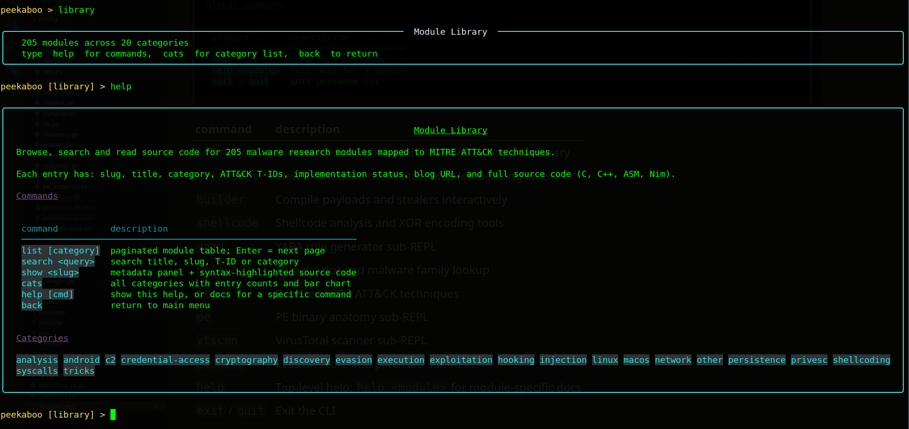    

| command | description |
|---------|-------------|
| `list [category]` | List all techniques, optionally filtered by category |
| `search <query>` | Full-text search across technique titles and body |
| `show <slug>` | Display metadata panel + syntax-highlighted source code |
| `categories` | List all available categories |
| `help` | Show all library commands |

Categories include: `analysis`, `android`, `c2`, `credential-access`, `cryptography`, `discovery`, `evasion`, `execution`, `exfiltration`, `injection`, `linux`, `macos`, `persistence`, `privilege-escalation`, `reconnaissance`.

### `builder` sub-REPL

Interactive payload builder with the same options as the dashboard builder.

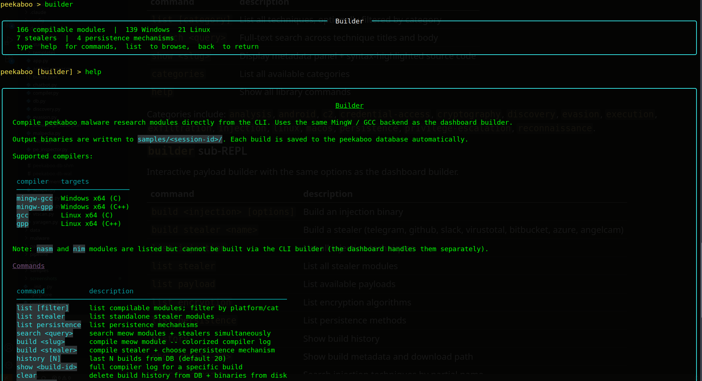    

| command | description |
|---------|-------------|
| `build <injection> [options]` | Build an injection binary |
| `build stealer <name>` | Build a stealer (telegram, github, slack, virustotal, bitbucket, azure, angelcam) |
| `list injection` | List all injection techniques |
| `list stealer` | List all stealer modules |
| `list payload` | List available payloads |
| `list encryption` | List encryption algorithms |
| `list persistence` | List persistence methods |
| `history` | Show build history |
| `show <build-id>` | Show build metadata and download path |
| `search <query>` | Search injection techniques by partial name |
| `help` | Full builder help |

Example:
```
peekaboo builder > build virtualallocex -e speck -p meow -r registry
peekaboo builder > build stealer telegram
```

### `shellcode` sub-REPL

Shellcode analysis and transformation tools.

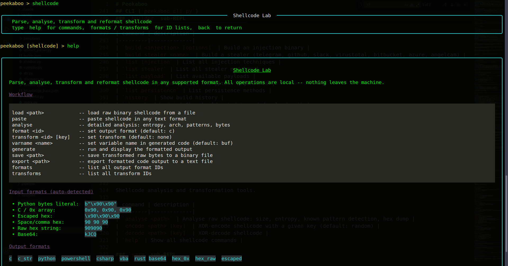    

| command | description |
|---------|-------------|
| `analyse <path>` | Analyse raw shellcode: size, entropy, known pattern detection, hex dump |
| `encode <path> [key]` | XOR-encode shellcode with a given key (default: random) |
| `decode <path> [key]` | XOR-decode shellcode |
| `help` | Show all shellcode commands |

### `yara` sub-REPL

Generate and manage YARA rules from binaries.

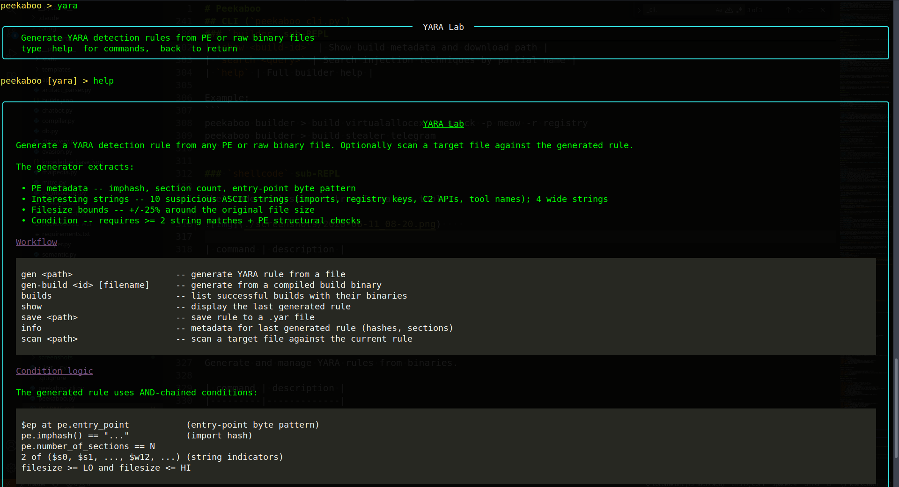    

| command | description |
|---------|-------------|
| `gen <path>` | Generate YARA rule from a PE binary at the given path |
| `gen-build [id] [fname]` | Generate rule from a compiled build binary |
| `gen-session <sid> <file>` | Generate rule from a session sample |
| `builds` | List available compiled builds |
| `save <path>` | Save the last generated rule to a `.yar` file |
| `show` | Print the last generated rule |
| `help` | Show all YARA commands |

### `malpedia` sub-REPL

Threat actor and malware family lookup against the Malpedia REST API with semantic blog post matching.

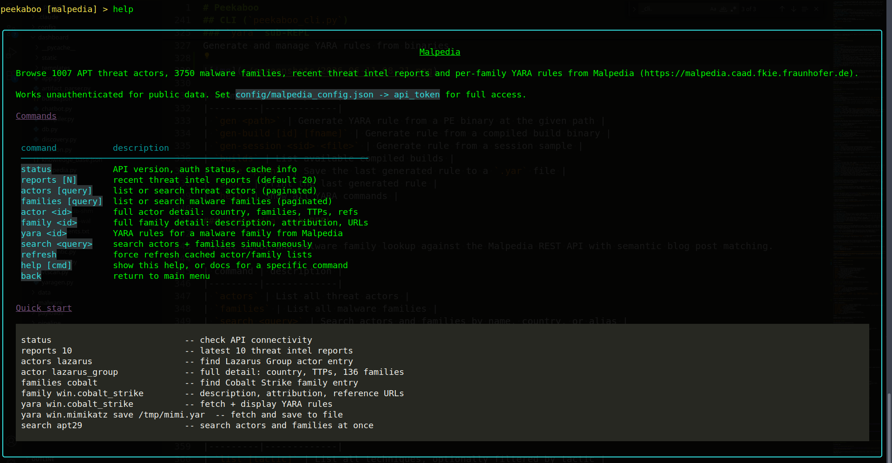    

| command | description |
|---------|-------------|
| `actors` | List all threat actors |
| `families` | List all malware families |
| `search <query>` | Search actors and families by name, country, or alias |
| `actor <id>` | Show actor detail + semantically matched blog posts |
| `family <id>` | Show family detail + semantically matched blog posts |
| `help` | Show all Malpedia commands |

### `ttp` sub-REPL

Browse MITRE ATT&CK techniques.

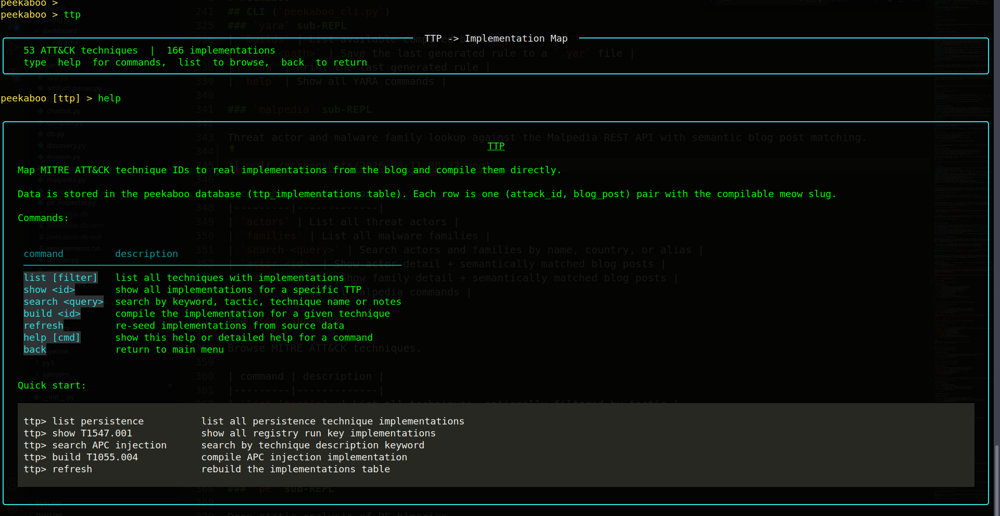    

| command | description |
|---------|-------------|
| `list [tactic]` | List all techniques, optionally filtered by tactic |
| `search <query>` | Search by technique name or description |
| `show <T-ID>` | Show full technique detail: tactic, description, detection notes, mapped blog posts |
| `tactics` | List all ATT&CK tactics |
| `help` | Show all TTP commands |

### `pe` sub-REPL

Deep static analysis of PE binaries.

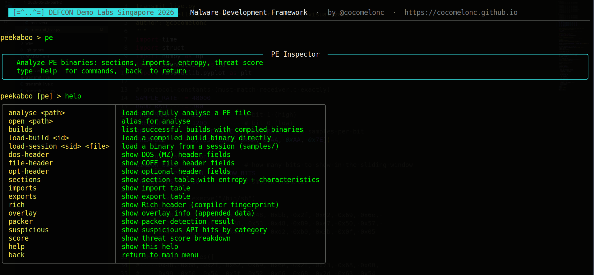    

| command | description |
|---------|-------------|
| `load <path>` | Load and analyse a PE binary from file path |
| `load-session <sid> <file>` | Load from a captured session sample |
| `load-build <id> [fname]` | Load from a compiled build binary |
| `builds` | List available compiled builds |
| `dos-header` | Print DOS (MZ) header fields |
| `file-header` | Print COFF file header fields with decoded characteristic flags |
| `opt-header` | Print optional header fields with DLL characteristic flags |
| `sections` | Print enriched section table (virt addr, virt size, raw offset, entropy, flags) |
| `imports` | Print import table grouped by DLL with suspicious API highlighting |
| `exports` | Print export table |
| `rich` | Print decoded Rich header entries |
| `overlay` | Print overlay detection result |
| `packer` | Print packer identification result |
| `summary` | Print overview panel (hashes, arch, entry point, threat score) |
| `help` | Show all PE commands |

### `vtscan` sub-REPL

Submit binaries to VirusTotal and query results.

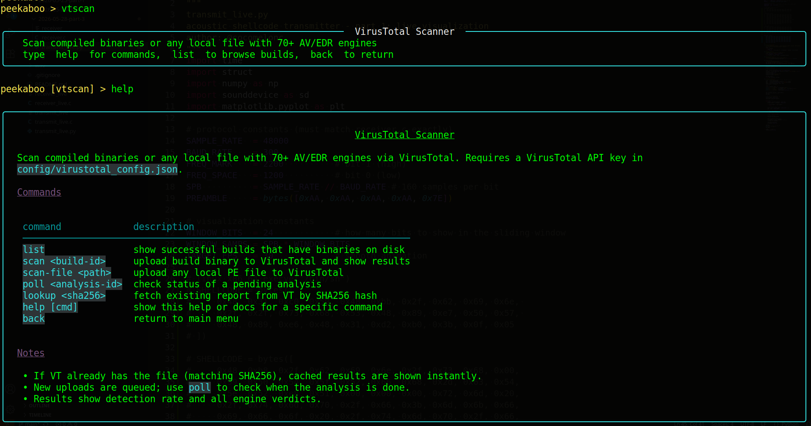    

| command | description |
|---------|-------------|
| `scan <path>` | Upload a binary and start analysis |
| `scan <id> [fname]` | Upload from a compiled build (optionally specify file) |
| `list` | List available compiled builds with per-file entries |
| `poll <analysis-id>` | Poll a pending analysis for results |
| `lookup <sha256>` | Fetch existing VT report by SHA256 |
| `help` | Show all vtscan commands |

### `evasion` sub-REPL

Static evasion scoring and binary patching.

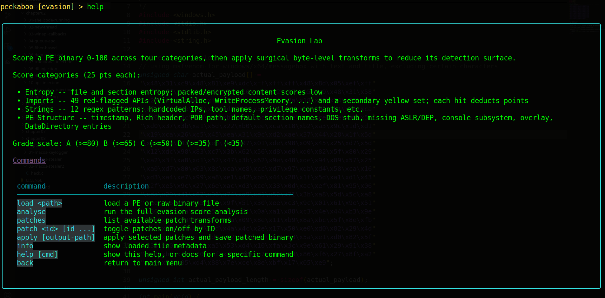    

| command | description |
|---------|-------------|
| `load <path>` | Load a binary for evasion analysis |
| `load-build <id> [fname]` | Load from a compiled build binary |
| `load-session <sid> <file>` | Load from a session sample |
| `builds` | List available compiled builds |
| `analyse` | Run evasion score analysis on the loaded binary |
| `patches` | List suggested evasion patches |
| `apply <patch-id>` | Apply a specific patch to the loaded binary |
| `apply-all` | Apply all suggested patches |
| `save <path>` | Save patched binary to file |
| `help` | Show all evasion commands |

### `hellsgate` sub-REPL

Parse `ntdll.dll` to extract SSNs, detect EDR hooks, recover hooked SSNs, and generate direct-syscall stubs.

| command | description |
|---------|-------------|
| `scan <path>` | Load and parse ntdll.dll from a file path |
| `filter <all\|clean\|hooked>` | Filter SSN table by hook status |
| `search <query>` | Search by function name substring |
| `show [page]` | Show current SSN table (paginated) |
| `select <name…>` | Toggle functions for code generation |
| `select-all` | Select all currently filtered functions |
| `select-hooked` | Select all hooked stubs at once |
| `select-common` | Select preset list of 19 common injection APIs |
| `deselect-all` | Clear selection |
| `generate <nasm\|c>` | Generate NASM x64 or C `__declspec(naked)` stubs for selected functions |
| `save <path>` | Save generated stubs to file |
| `help` | Show all hellsgate commands |

### `scemu` sub-REPL

Emulate x86/x64 shellcode with Unicorn Engine and inspect CPU state.

| command | description |
|---------|-------------|
| `run <path>` | Load and emulate a raw shellcode binary |
| `hex <hex-string>` | Emulate shellcode from hex input (`\xNN`, `0xNN,`, or raw hex) |
| `disasm <path>` | Disassemble-only mode (no execution) |
| `arch <x64\|x86>` | Set emulation architecture (default: x64) |
| `maxinsns <N>` | Set instruction count limit (default: 10 000, max: 50 000) |
| `trace` | Print per-instruction trace from last emulation |
| `regs` | Print final register state from last emulation |
| `mem` | Print memory access log from last emulation |
| `api` | Print intercepted API calls from last emulation |
| `strings` | Print extracted strings from last emulation |
| `smc` | Show self-modifying code detection result |
| `help` | Show all scemu commands |

### `antianalysis` sub-REPL

Scan PE binaries or raw shellcode for anti-debug, anti-VM, timing, and evasion patterns.

| command | description |
|---------|-------------|
| `scan <path>` | Scan a binary file for anti-analysis patterns |
| `scan-build [id] [fname]` | Scan a compiled build binary |
| `scan-session <sid> <file>` | Scan a session sample |
| `arch <auto\|x64\|x86>` | Set disassembly architecture (default: auto) |
| `filter <all\|anti-debug\|anti-vm\|timing\|evasion>` | Filter findings by category |
| `list` | List all findings from the last scan |
| `export <path>` | Export findings to a JSON file |
| `builds` | List available compiled builds |
| `help` | Show all antianalysis commands |

### `rop` sub-REPL

Find ROP gadgets in PE binaries and build exploit chains.

| command | description |
|---------|-------------|
| `scan <path>` | Scan a PE binary for ROP gadgets |
| `scan-build [id] [fname]` | Scan a compiled build binary |
| `scan-session <sid> <file>` | Scan a session sample |
| `arch <auto\|x64\|x86>` | Set disassembly architecture (default: auto) |
| `base <hex>` | Override image base address (e.g. `base 0x180000000`) |
| `filter <semantic>` | Filter gadgets by semantic class (reg_load, stack_pivot, syscall, etc.) |
| `search <keyword>` | Search gadgets by mnemonic or operand keyword |
| `list` | List filtered gadgets (paginated) |
| `chain-add <index>` | Add gadget by list index to the chain |
| `chain-add-addr <hex>` | Add gadget by address to the chain |
| `chain-arg <slot> <hex>` | Set a stack argument value for a chain slot |
| `chain-show` | Display the current chain |
| `chain-clear` | Clear the chain |
| `generate <c\|python>` | Generate C `ULONG_PTR` array or Python `struct.pack` payload |
| `save <path>` | Save generated payload to file |
| `builds` | List available compiled builds |
| `help` | Show all rop commands |

## virus total result:
02 september 2021


[https://www.virustotal.com/gui/file/c930b9aeab693d36c68e7bcf6353c7515b8fffc8f9a9233e49e90da49ab5d470/detection](https://www.virustotal.com/gui/file/c930b9aeab693d36c68e7bcf6353c7515b8fffc8f9a9233e49e90da49ab5d470/detection)

30 december 2021 (NT API injector)    

    

[https://www.virustotal.com/gui/file/743f50e92c6ef48d6514e0ce2a255165f83afb1ae66deefd68dac50d80748e55/detection](https://www.virustotal.com/gui/file/743f50e92c6ef48d6514e0ce2a255165f83afb1ae66deefd68dac50d80748e55/detection)    

## antiscan.me result:

11 january 2022 (NT API injector)    

    

[https://antiscan.me/scan/new/result?id=rQVfQhoFYgH9](https://antiscan.me/scan/new/result?id=rQVfQhoFYgH9)    

## websec.nl scanner result:

10 October 2024     

     

[https://websec.net/scanner/result/a3583316-cb72-4894-bd22-48241ca79db9](https://websec.net/scanner/result/a3583316-cb72-4894-bd22-48241ca79db9)     

## Attention
This tool is a Proof of Concept and is for Educational Purposes Only!!! Author takes no responsibility of any damage you cause

## License
[MIT](https://choosealicense.com/licenses/mit/)
