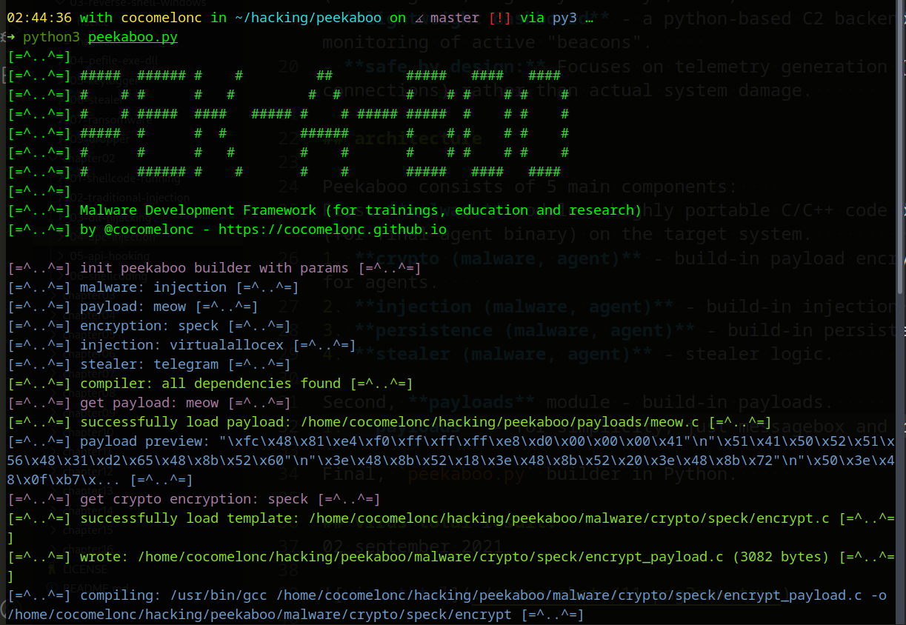

# Peekaboo

Peekaboo is a modular framework designed to safely emulate malware behavior. It allows security researchers, red teamers, and blue teamers to reproduce complex threat scenarios - including Command & Control (C2) communication, persistence mechanisms, and lateral movement - without using destructive payloads.     

**The goal of Peekaboo is to accelerate detection engineering and operator training by providing predictable, reproducible, and safe threat artifacts.**    

## key features (how it works?)

- malware **source code template** - build a payload/stealer from templates (select C2 channel & data collection modules).
- **payload generator** - automated generation of C/C++ based payloads with built-in obfuscation (API hashing, string encryption).    
- **AV/EDR bypass** - encryption/encoding (syscalls)        
- **multi-channel C2** - support for various covert channels:
    - standard HTTP/S    
    - GitHub (abusing Issues/Commits)    
    - Telegram & Discord Webhooks    
    - TODO: adding all channels from one of [my recent research](https://www.youtube.com/watch?v=l2G2TZvzj0E)     
- **exfiltration** - staged exfil to controlled endpoints (Github/Discord/Slack/VirusTotal message).      
- **evasive persistence** - modular implementation of Windows (Linux, MacOS) persistence (LaunchAgents, Registry Run Keys, etc.).    
- **lightweight dashboard** - a python-based C2 backend and dashboard for real-time monitoring of active "beacons".     
- **safe by design:** Focuses on telemetry generation (process creation, network connections) rather than actual system damage.      

## architecture

Peekaboo consists of 5 main components:    
First **malware** module - highly portable C/C++ code designed to build specific "behaviors" (for final agent binary) on the target system.            
1. **crypto (malware, agent)** - build-in payload encryption/decryption logic constructor for agents.    
2. **injection (malware, agent)** - build-in injection logic constructor for agents.      
3. **persistence (malware, agent)** - build-in persistence logic constructor for agents.     
4. **stealer (malware, agent)** - stealer logic.      

Second, **payloads** module - build-in payloads.     
1. **payloads** - for simplicity, just messagebox and reverse shell.      

Final, `peekaboo.py` builder in Python.     

### demo

Run:    

```bash
python3 peekaboo.py
```

    

## virus total result:
02 september 2021


[https://www.virustotal.com/gui/file/c930b9aeab693d36c68e7bcf6353c7515b8fffc8f9a9233e49e90da49ab5d470/detection](https://www.virustotal.com/gui/file/c930b9aeab693d36c68e7bcf6353c7515b8fffc8f9a9233e49e90da49ab5d470/detection)

30 december 2021 (NT API injector)    

    

[https://www.virustotal.com/gui/file/743f50e92c6ef48d6514e0ce2a255165f83afb1ae66deefd68dac50d80748e55/detection](https://www.virustotal.com/gui/file/743f50e92c6ef48d6514e0ce2a255165f83afb1ae66deefd68dac50d80748e55/detection)    

## antiscan.me result:

11 january 2022 (NT API injector)    

    

[https://antiscan.me/scan/new/result?id=rQVfQhoFYgH9](https://antiscan.me/scan/new/result?id=rQVfQhoFYgH9)    

## websec.nl scanner result:

10 October 2024     

     

[https://websec.net/scanner/result/a3583316-cb72-4894-bd22-48241ca79db9](https://websec.net/scanner/result/a3583316-cb72-4894-bd22-48241ca79db9)     

## Attention
This tool is a Proof of Concept and is for Educational Purposes Only!!! Author takes no responsibility of any damage you cause

## License
[MIT](https://choosealicense.com/licenses/mit/)
